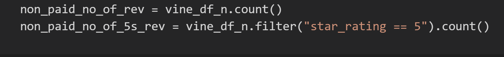
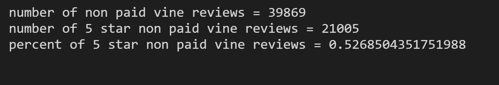
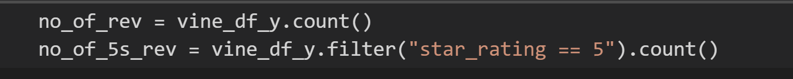
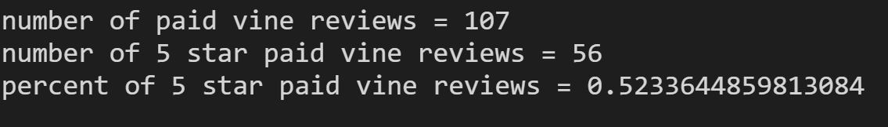

# Amazon_Vine_Analysis

The overview of this data analysis was to determine if bias towards 5 star reviews, was taken place as part of the Vine program. 

## Results:

- How many Vine reviews and non-Vine reviews were there?
  - The number of paid Vine reviews were 107 and the number of non paid Vine reviews were 39, 869.    
- How many Vine reviews were 5 stars? How many non-Vine reviews were 5 stars?
  - The number of paid Vine 5 star reviews were 56 and the number of non Vine 5 star reviews were 21,005.
- What percentage of paid Vine reviews were 5 stars? 
  - The percent of paid Vine 5 star reviews was .52.3 %.
- What percentage of non-Vine reviews were 5 stars?
  - The percent of non paid Vine 5 star reviews was 52.7%.

Breakdown of results shown for non paid Vine Reviews:

Break down of results for Paid Vine Reviews:

 
   

##  Summary:
In summary, this data analysis indicates there was a slight difference between a non Vine 5 star review (52.7%) verses a paid Vine 5 star review (52.3%). Therefore, having a paid Vine review made no difference in the percentage of 5-star reviews based on these percentages. To further support or disprove this result, the same analysis could take place for a 4 star review between the non paid Vine and paid Vine reviews.

